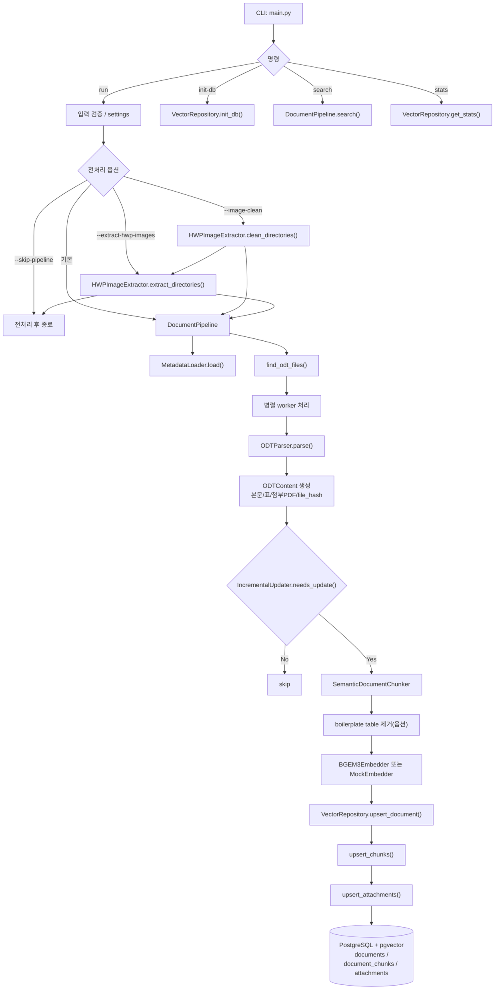
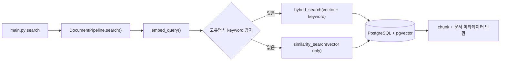

# 아키텍처 개요

이 문서는 현재 코드 기준 파이프라인 구조를 요약합니다.

핵심 엔트리포인트는 `main.py`이고, 실제 적재 처리는 `src/pipeline/processor.py`의 `DocumentPipeline`이 담당합니다.

## 1. 전체 파이프라인 모식도

## 2. 검색 흐름

## 3. 모듈 책임

- `main.py`
  - CLI 진입점
  - 경로/옵션 검증
  - 이미지 전처리와 벡터 파이프라인 실행 순서 제어
- `config/settings.py`
  - 환경변수 기반 설정 로딩
  - DB URL, 임베딩 모델, 데이터 경로, 전처리 옵션 관리
- `src/pipeline/processor.py`
  - 메인 적재 오케스트레이션
  - 증분 처리 판단
  - 파서, 청커, 임베더, 저장소 연결
- `src/parsers/odt_parser.py`
  - ODT 본문/표/첨부 PDF 메타정보 추출
  - `ODTContent` 생성
- `src/metadata/loader.py`
  - 엑셀 메타데이터 로딩
  - 문서 분류, 부서, 상태 정보 매핑
- `src/chunkers/semantic_chunker.py`
  - 본문 텍스트 청킹
  - 표는 별도 chunk로 유지
- `src/embeddings/bge_embedder.py`
  - BGE-M3 임베딩 생성
  - 테스트용 Mock embedder 제공
- `src/vectordb/repository.py`
  - PostgreSQL/pgvector CRUD
  - 유사도 검색 / hybrid 검색
- `src/vectordb/models.py`
  - `documents`, `document_chunks`, `attachments` 스키마 정의
  - pgvector extension / index 초기화
- `src/converters/hwp_image_extractor.py`
  - HWP 내장 이미지 추출 및 `_images` 정리
- `src/extract_hwp_images.py`
  - HWP 이미지 추출/정리 전용 CLI

## 4. 현재 입력/출력 기준

- 주 적재 입력: `ODT`
- 보조 전처리 입력: `HWP` 내장 이미지 추출
- 저장 대상:
  - 문서 메타데이터
  - 청크 텍스트
  - 1024차원 임베딩 벡터
  - 첨부 PDF 정보

## 5. 현재 메인 경로에 직접 연결되지 않은 보조 유틸

- `src/converters/hwpx_converter.py`
  - LibreOffice 기반 `HWP/HWPX -> PDF` 변환 유틸
  - 현재 `main.py run` 주 경로에는 직접 연결되어 있지 않음
  - 필요 시 별도 전처리 단계로 연결 가능

## 6. 운영 관점 요약

- 메인 적재 파이프라인은 `ODT -> 파싱 -> 청킹 -> 임베딩 -> pgvector 적재` 구조입니다.
- `--image-clean`, `--extract-hwp-images`, `--skip-pipeline` 조합으로 HWP 이미지 전처리만 분리 실행할 수 있습니다.
- 검색은 기본 벡터 검색이고, 특정 명사 감지 시 hybrid 검색으로 자동 전환됩니다.
